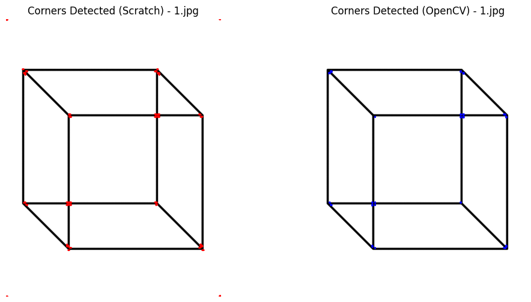
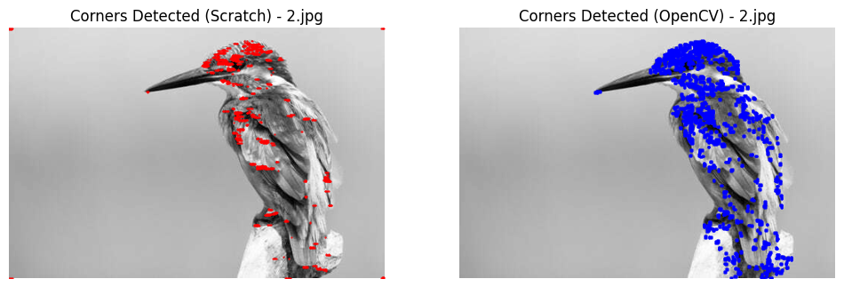
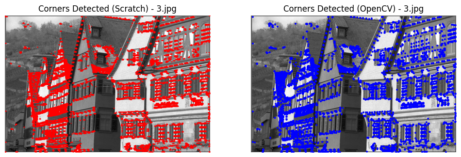
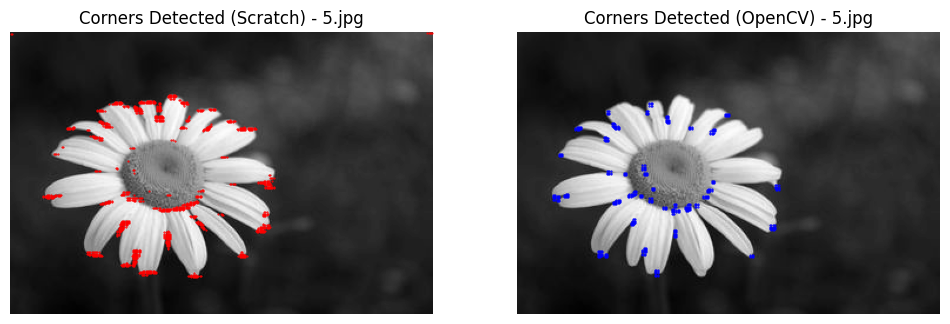
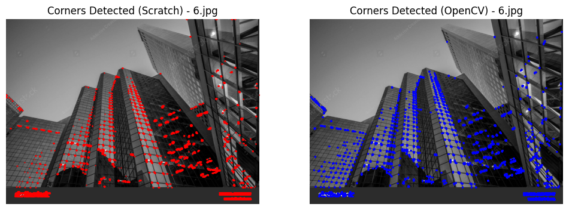
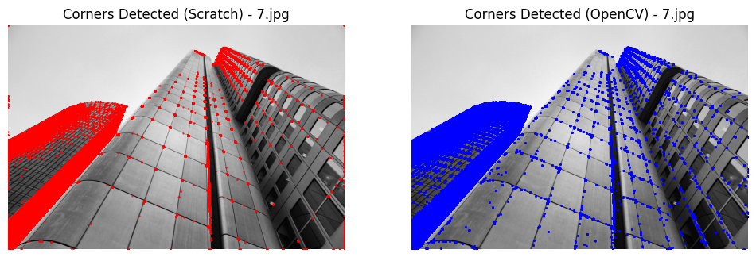
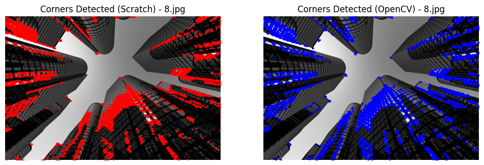
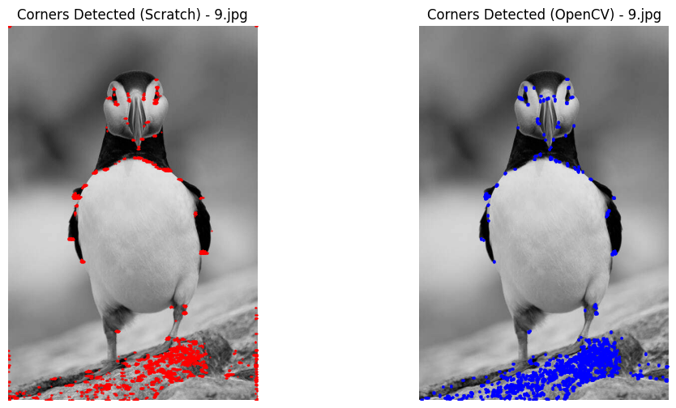
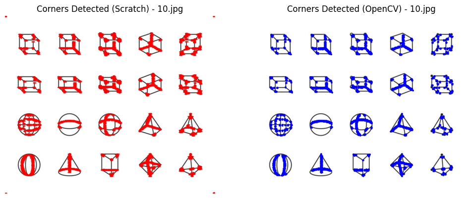
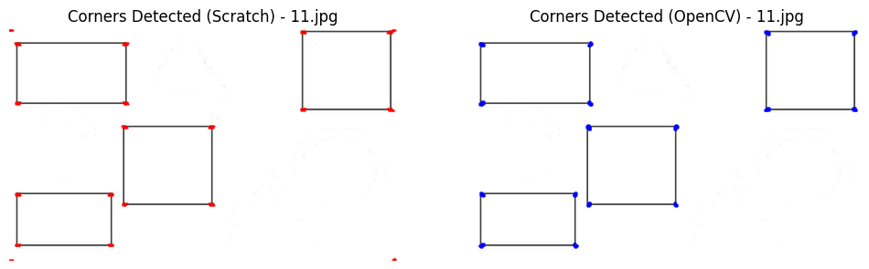

# Detecting-Corners-in-an-Image-using-Harris-Corner-detection

This project implements Harris Corner Detection as part of an assignment in Computer Vision.

## Task Overview

The goal is to detect Harris corners in images using a custom approach. Ten images (in `.gif`, `.jpeg`, and `.jpg` formats) were provided for this task. All images were converted to `.jpg` format for consistent processing.

## Steps for Harris Corner Detection

### 1. Compute Gradients
Convert each image to grayscale and use a custom Sobel filter to compute the horizontal (\( I_x \)) and vertical (\( I_y \)) gradients of the image.

### 2. Subtract Gradient Mean
Calculate the mean of the horizontal and vertical gradients, then subtract these means from each respective gradient.

Formulas:
\[
I_{x_{\text{mean}}} = \frac{\sum I_x}{\text{count}(I_x)}
\]
\[
I_{y_{\text{mean}}} = \frac{\sum I_y}{\text{count}(I_y)}
\]

### 3. Compute Covariance Matrix
Calculate the elements required for the covariance matrix:
- \( I_{xx} = I_x \times I_x \)
- \( I_{xy} = I_x \times I_y \)
- \( I_{yy} = I_y \times I_y \)

Apply a Gaussian function to smoothen these gradient images, yielding \( S_{xx} \), \( S_{xy} \), and \( S_{yy} \).

### 4. Calculate Harris Response
Calculate the Harris response by first determining the determinant and trace of the matrix \( M \):

\[
M = \begin{bmatrix} S_{xx} & S_{xy} \\ S_{xy} & S_{yy} \end{bmatrix}
\]
\[
\text{Response} = \text{Det}(M) - k \cdot (\text{Trace}(M))^2
\]

where \( k \) is the threshold parameter.

### 5. Apply Threshold for Corner Detection
Set a threshold to identify corners:
\[
\text{threshold} = 0.01 \times \max(\text{Response})
\]

### 6. Plotting Detected Corners
Plot the original images along with the detected corners.

## Results

The following figure shows the output of Harris Corner Detection:

  
  
  
 

